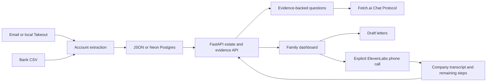

# Build-plan acceptance map

This checklist distinguishes repository work from external setup. The user requested code without creating accounts or committing. The original document's instructions to commit, push, contact sponsors, create accounts, submit, and upload are team planning instructions; they are not actions performed by this implementation.

| Plan requirement | Implementation / verification |
|---|---|
| Scratch project and offline end-to-end setup | README, requirements, configuration, generator, rules extraction, API, static dashboard |
| Account and estate contracts, evidence endpoints | Models and server; email evidence excludes hidden truth; bank rows retain their IDs |
| Existing baseline plus richer synthetic cases | Generator and independent truth file; recall measured by pipeline |
| Apple line items; distinct Chase products | Extraction emits multiple accounts per sender and merges only compatible products |
| Active flags, urgent renewals, totals | Pipeline summaries; stale subscriptions excluded from charge totals |
| Gmail Takeout | Local mbox import with filtering, dates, decoded headers, body limits, no truth labels |
| Recurring bank detection and email merge | Bank analyzer, merchant aliases, evidence/source unions |
| Family Hub and preserved edits | JSON/Postgres adapter, schema, status/assignment patch and activity history |
| Plan-ahead, sources, coverage, drawer, responsive demo | Static dashboard and demo URL; verify viewport sizes in a browser |
| Five letter actions | Deterministic templates and validated optional Anthropic generation; drafts only |
| ElevenLabs outbound call and truthful transcript | `calls.py`, explicit dashboard action, provider IDs, known-call metadata, conservative completion |
| Fetch.ai Chat Protocol | `fetch_agent.py`, optional dependency file, stable configured seed, citation proxy and synthetic/private access restrictions |
| Sponsor setup | Later manual account setup and live checks in `integrations.md` |
| Pitch and submission copy | `pitch.html` five-slide local deck and `devpost-draft.md` |
| Speakerphone rehearsal and backup video | `roleplay.md` and `demo.md`; record actual configured call later |
| Neon shared state between two laptops | Code supplied; perform actual Neon/shared-backend check once account exists |
| Real teammate Takeout review | Importer supplied; evaluate on that teammate's machine with their authorized data |
| Prize eligibility and external publishing | Team checks current rules and publishes manually after choosing to commit |
| Requested security hardening | `SECURITY.md`, private-data auth/encryption, cookie/CSRF/CSP protections, verified database TLS, scoped agent credentials, bounded requests and durable call controls; adversarial and browser regressions |

## Architecture

Offline recall validates a controlled fixture. Missing accounts in other sources remain possible; the app's coverage checklist points to further searches. A balance or policy amount in an email is evidence to investigate, not proof that a family is entitled to that amount. Status updates are family workflow state; an automated completed cancellation requires a company confirmation.
